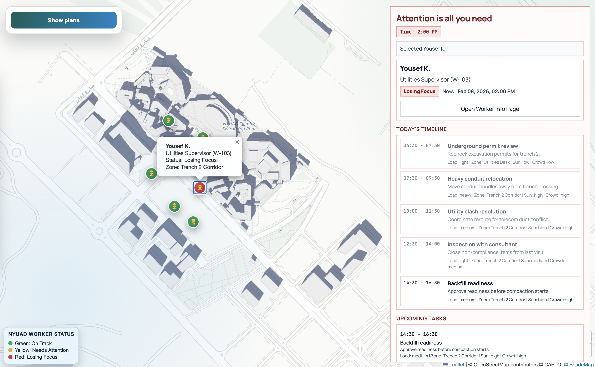

# Attention is all you need

Winner of the **c0mpiled hackathon**.

A full-stack worker safety and focus-planning app with:
- live worker map and status tracking
- AI-assisted reassignment for at-risk workers
- prompt-based task generation
- dedicated worker profile dashboard page

## Screenshot



## Tech Stack

- Backend: Node.js + Express (`server.js`)
- Frontend planner: modular ES modules (`public/src/planner/*`)
- Frontend profile page: React JSX components without a bundler (`public/src/employee/*`)

## Project Structure

```text
.
├── server.js
├── package.json
├── public
│   ├── index.html
│   ├── add_new_employee.html
│   ├── lifting-cargo-platform-pov.mp4
│   └── src
│       ├── planner
│       │   ├── api
│       │   │   └── client.mjs
│       │   ├── app
│       │   │   └── main.mjs
│       │   ├── components
│       │   │   └── appShell.mjs
│       │   ├── config
│       │   │   └── constants.mjs
│       │   ├── data
│       │   │   └── workers.mjs
│       │   ├── domain
│       │   │   ├── tasks.mjs
│       │   │   ├── time.mjs
│       │   │   └── workers.mjs
│       │   ├── map
│       │   │   ├── shadeController.mjs
│       │   │   └── workerOverlay.mjs
│       │   ├── styles
│       │   │   └── planner.css
│       │   ├── ui
│       │   │   ├── controller.mjs
│       │   │   └── domRefs.mjs
│       │   └── utils
│       │       └── format.mjs
│       └── employee
│           ├── components
│           │   ├── BrainSignalsChart.jsx
│           │   ├── LiveVideoCard.jsx
│           │   ├── PerformanceAnalysisCard.jsx
│           │   ├── TopNav.jsx
│           │   └── VideoTrackingCard.jsx
│           ├── data
│           │   └── employeeData.js
│           ├── pages
│           │   └── AddEmployeePage.jsx
│           └── styles
│               └── dashboard.css
└── .env.example
```

## Environment

Create `.env` (or copy from `.env.example`):

```bash
SHADEMAP_API_KEY=YOUR_SHADEMAP_API_KEY_HERE
GROQ_API_KEY=YOUR_GROQ_API_KEY_HERE
GROQ_MODEL=llama-3.3-70b-versatile
PORT=3000
```

Notes:
- `GROQ_API_KEY` enables AI reassignment and prompt-based task generation.
- `SHADEMAP_API_KEY` enables map shadow simulation.

## Run

```bash
npm install
npm run dev
```

Open:
- Planner: `http://localhost:3000/`
- Worker profile page: `http://localhost:3000/add_new_employee.html`

## Why This Refactor

- Clear feature boundaries (`planner` vs `employee`)
- Smaller focused modules (`domain`, `map`, `ui`, `components`)
- React JSX split into reusable `pages` and `components`
- Easier onboarding and faster feature iteration
